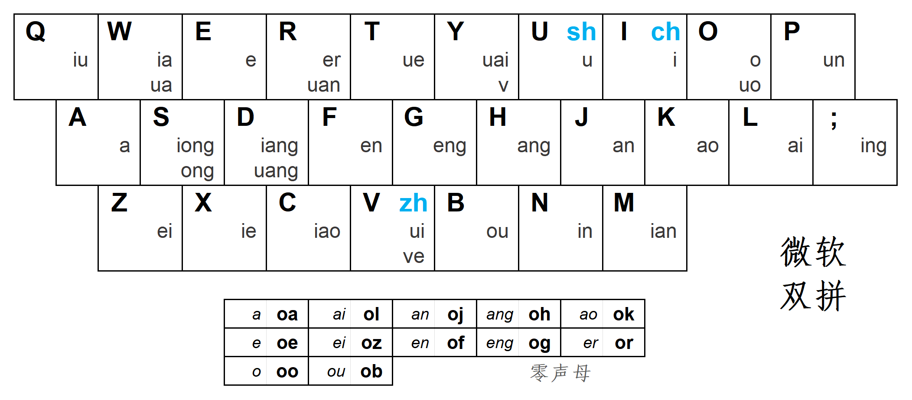

# README

> 这是基于5分钟商学院的学习笔记

**目录**

   商业篇

      消费心理学

      1.心理账户

      2.沉没成本

      3.比例偏见

      4.规避损失

      5.价格锚点

   五大基础逻辑

      1.心理账户

> **一句话总结**

?> 人们会在心里把金钱分成不同的账户，想要用户心甘情愿地花大价钱购买产品，就要想办法将产品定位到用户的愿意花大价钱的心理账户。

> **案例：**

?> 一个设计独特的牙刷如何卖到99元？保护她，可以从一把好牙刷开始。看把，这句话就是将生活必要开支的账户转化为送给伴侣的礼物的情感维系账户了。

> **原文划线**

?> 你要改变顾客对你商品的认知，让他从不愿意花钱的心理账户，转移到愿意为此付钱的那个心理账户里面去，这个时候，你就会发现，可能曾经很小气的客户变得非常大方起来。你的客户其实并不真的是小气，而是你的这个商品，并不在他愿意为此付费的那个心理账户里面。 2.沉没成本

> **一句话总结**

?> 人们往往会因为前期的投入而影响判断

> **案例：**

?> 一个项目前期投入

> **原文划线**

   

